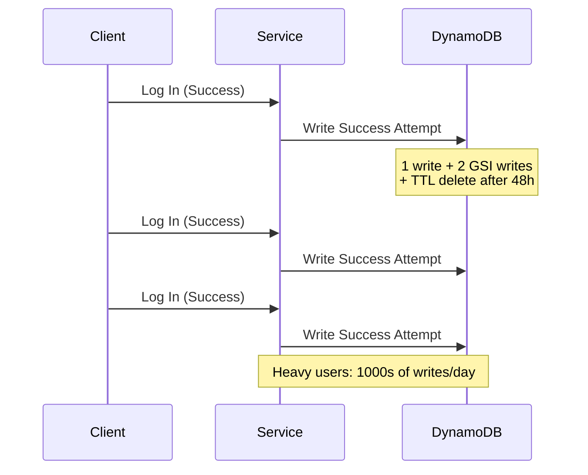
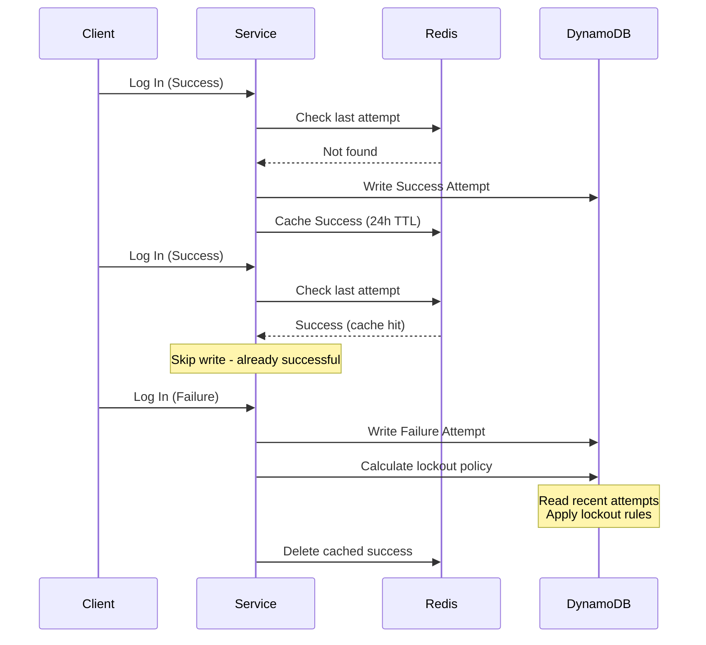

## The Problem

We had a seemingly simple requirement: track login attempts for account lockout policies. Every successful login generated three database writes (primary table + two GSI updates). At peak traffic, we hit 2,600 TPS with 85 million operations daily, not counting TTL deletes. Write amplification hit us hard.

This created four problems:

1. **Write Amplification**: Each success attempt generated 3 writes (primary table + 2 GSI updates), replicated across regions
2. **Cost Pressure**: Despite being relatively small in data size, TTL deletions, cross-region replication, and multiple GSIs made this table disproportionately expensive
3. **Availability Risk**: Intermittent AWS service degradation caused error spikes that were compounded by upstream retries, affecting even successful logins
4. **GSI Partition Risk**: The GSI stores a secondary identifier shared across all entries for a user. With DynamoDB's 10 GB limit per partition and increasing write traffic, we risked hitting capacity constraints that would throttle writes for affected users

The aha moment: we had a write-heavy operation for temporal data we rarely read. We only needed this data when logins failed, but with a high success rate, we were slowing down the happy path for everyone with no real benefit.

## The Solution

We realized that **successful attempts only indicate the absence of consecutive failures**. We didn't need a complete history, just recent state.

This insight enabled a simple caching strategy:

1. Cache successful attempts in Redis with a 24-hour TTL (±10% jitter)
2. On failed attempts, clear the Redis cache and trigger lockout policy calculations using DynamoDB
3. Keep DynamoDB as the source of truth with Redis as a soft dependency

### Architecture: Before



### Architecture: After



## Implementation Details

### What to cache?

The question: cache everything, cache failures only, or cache successes only?

**Option 1: Migrate entirely to Redis and eliminate DynamoDB**

Complete cache coverage, but this requires managing multiple failure events per user with individual TTLs. We evaluated Redis HASHes with per-field expiration (`HEXPIRE`) to store all attempts in one structure:

```
digid:attempts → {attemptId1: failureData, attemptId2: failureData, success: successData}
```

**Blocker:** Valkey (our Redis implementation) doesn't support `HEXPIRE` ([Issue #2778](https://github.com/valkey-io/valkey/issues/2778)). Without this, we'd need separate Redis keys per failure attempt (memory inefficient) with cleanup jobs (operational complexity) to prevent stale objects.

We'd also need a dedicated Redis cluster with `volatile-ttl` eviction policy since our existing cluster uses `allkeys-lru`. Standing up new infrastructure wasn't justified.

**Option 2: Cache only failures**

Fewer events to cache since failures are less frequent.

**Rejected.** High-volume users like automated systems generate most of the write pressure through repeated successful logins. Caching failures doesn't solve the problem.

**Option 3: Cache only successes** ✓

Single Redis key per user with simple SET/GET/DELETE operations. This addresses the dominant traffic pattern (repeated successes). Lockout calculations still use DynamoDB on failures, which is fine since failures are infrequent.

### Soft Dependency Pattern

We designed the caching layer to fail gracefully. If Redis has issues, logins still work. The implementation:

- 40ms read/write timeouts for fast fallback
- Treat any Redis error as a cache miss (triggers DynamoDB write)
- Circuit breakers for automatic failover during degradation
- Feature flag as a kill switch

Optimistic caching with pessimistic error handling.

### TTL Strategy

We chose a 24-hour TTL with ±10% jitter because most users log in once per day, and the jitter prevents cache expiration thundering herds.

## Results

| Metric                            | Improvement                             |
| --------------------------------- | --------------------------------------- |
| **PreProd Write Volume**          | 98% reduction                           |
| **Production Write Volume**       | 75% reduction                           |
| **DynamoDB Consumed Write Units** | 120k → 20k baseline<br/>320k → 60k peak |
| **Cost Impact**                   | ~90% reduction in DynamoDB costs        |

The graph below shows the production impact over time. The sharp drop in August 2025 marks when we rolled out the caching solution:



The difference between environments reflects traffic patterns. Test account reuse in preproduction creates higher cache hit rates, while production sees more first-time daily logins.

## Conclusion

Lockout policies only need recent attempt state, not complete history. Recognizing this let us reduce database writes by 75-98% while improving availability. We were storing every successful login when we actually just needed proof that consecutive failures hadn't occurred.

Good architecture comes from understanding your access patterns and working within platform constraints. Write amplification compounds fast with TTL deletes, GSI replication, and high throughput, even for small tables. The soft dependency pattern kept our critical authentication path reliable while Redis gave us the performance wins. And sometimes the biggest gains come from questioning what you're storing in the first place.
